# 🤖 Invoice Processing Agent with Human-in-the-Loop (HITL)

A sophisticated **LangGraph-powered invoice processing system** that combines AI automation with human oversight for enterprise-grade accuracy and compliance.

## 🌟 Features

### 🔥 Core Capabilities

- **AI-Powered OCR**: Extracts structured data from invoice images (PDF, PNG, JPG)
- **Purchase Order Matching**: Intelligent two-way matching against existing PO records
- **Human-in-the-Loop**: Pauses for human review when confidence thresholds aren't met
- **Workflow Automation**: Complete end-to-end processing from upload to ERP posting
- **Real-time Status**: Live workflow tracking with detailed execution logs
- **RESTful API**: Modern FastAPI backend with automatic OpenAPI documentation

### 🧠 Advanced AI Features

- **Smart Vendor Normalization**: Handles vendor name variations and aliases
- **Discrepancy Detection**: Identifies amount, item, and quantity mismatches
- **Contextual Decision Making**: Uses business rules and approval policies
- **Multi-tool Integration**: OCR, ERP systems, and notification services

### 🛠 Technical Excellence

- **LangGraph Workflow Engine**: State management with built-in checkpointing
- **Persistent State**: Automatic recovery and resume capabilities
- **MCP Servers**: Modular tool architecture for extensibility
- **SQLite Backend**: Reliable data persistence with WAL mode
- **Modern UI**: Clean web interface for human reviewers

## 🏗 Project Structure

```
assessment/
├── README.md                 # This file
├── .gitignore               # Git ignore rules
├── main.py                  # Application entry point
├── requirements.txt         # Python dependencies
├── setup_data.py           # Generate test data
├── test_*.py               # Test suite
├── data/                   # Database and file storage
│   ├── demo.db            # SQLite database
│   ├── uploads/           # Uploaded files
│   └── storage/           # Processed attachments
└── src/                    # 📦 Source code
    ├── __init__.py
    ├── agent_api.py        # FastAPI application
    ├── langgraph_workflow.py # Workflow definition
    ├── workflow_nodes.py   # Individual workflow nodes
    ├── logger.py          # Logging utilities
    ├── config/            # Configuration
    │   └── workflow.json  # Workflow settings
    ├── tools/             # AI tools
    │   └── bigtool_picker.py # Dynamic tool selection
    ├── mcp_servers/       # Model Context Protocol servers
    │   ├── atlas_server.py    # ERP integration
    │   └── common_server.py   # Core business logic
    └── ui/                # Web interface
        └── index.html     # Human review interface
```

## 🚀 Quick Start

### Prerequisites

- Python 3.12+
- pip or poetry
- Virtual environment (recommended)

### Installation

1. **Clone and navigate to project**

   ```bash
   cd assessment
   ```

2. **Create virtual environment**

   ```bash
   python -m venv .venv
   
   # Windows
   .venv\Scripts\activate
   
   # Linux/Mac
   source .venv/bin/activate
   ```

3. **Install dependencies**

   ```bash
   pip install -r requirements.txt
   ```

### Running the Application

**Start the server:**

```bash
python main.py
```

The application will be available at:

- 🌐 **API**: http://localhost:8000
- 📚 **API Docs**: http://localhost:8000/docs
- 🖥 **Web UI**: http://localhost:8000

## 📋 API Reference

### Core Endpoints

#### Upload & Process Invoice

```http
POST /api/agent/invoke
Content-Type: multipart/form-data

# Form fields:
- image: file (optional) - Invoice image/PDF
- invoice_data: string (optional) - JSON invoice data

# At least one field required
```

#### Check Processing Status

```http
GET /api/agent/status/{thread_id}
```

#### List Pending Reviews

```http
GET /human-review/pending
```

#### Submit Human Decision

```http
POST /human-review/decision
Content-Type: application/json

{
  "thread_id": "thread_abc123",
  "decision": "ACCEPT|REJECT",
  "reviewer_id": "user@company.com",
  "notes": "Optional review notes"
}
```

#### View Execution Logs

```http
GET /api/agent/logs/{thread_id}
```

## 🔄 Workflow Overview

```mermaid
graph TD
    A[📤 Upload Invoice] --> B[🔍 OCR Extraction]
    B --> C[📋 Parse & Validate]
    C --> D[🔗 PO Matching]
    D --> E{📊 Match Score?}
    E -->|High| F[✅ Auto-approve]
    E -->|Low| G[⏸ Human Review]
    G --> H{👤 Decision}
    H -->|Accept| I[💼 Reconcile]
    H -->|Reject| J[📞 Manual Handoff]
    F --> I
    I --> K[📋 Generate Entries]
    K --> L[💾 Post to ERP]
    L --> M[📧 Send Notifications]
    M --> N[🎯 Complete]
```



## ✅ Processing Checklist

```
1. INTAKE          (retry: 3x) ✅
2. UNDERSTAND      (retry: 3x) ✅
3. PREPARE         (retry: 3x) ✅
4. RETRIEVE        (retry: 3x) ✅
5. MATCH_TWO_WAY   (retry: 3x) ✅
6. CHECKPOINT_HITL (no retry)  ✅ Creates checkpoint
7. HITL_DECISION   (no retry)  ✅ PAUSES here if needed
8. RECONCILE       (retry: 3x) ✅ Continues after ACCEPT
9. APPROVE         (retry: 3x) ✅
10. POSTING        (retry: 3x) ✅
11. NOTIFY         (retry: 3x) ✅
12. COMPLETE       (retry: 3x) ✅

add this (See <attachments> above for file contents. You may not need to search or read the file again.)
```
## 🎯 Usage Examples

### 1. Process Invoice Image

```python
import requests

# Upload invoice image
files = {'image': open('invoice.png', 'rb')}
response = requests.post('http://localhost:8000/api/agent/invoke', files=files)
thread_id = response.json()['thread_id']

# Check status
status = requests.get(f'http://localhost:8000/api/agent/status/{thread_id}')
print(status.json())
```

### 2. Submit JSON Invoice Data

```python
import requests

invoice_data = {
    "invoice_id": "INV-2024-001",
    "vendor_name": "Tech Solutions Inc",
    "amount": 1250.75,
    "invoice_date": "2024-12-07",
    "line_items": [
        {"description": "Software License", "amount": 1250.75}
    ]
}

response = requests.post(
    'http://localhost:8000/api/agent/invoke',
    data={'invoice_data': json.dumps(invoice_data)}
)
```

### 3. Human Review Decision

```python
import requests

decision = {
    "thread_id": "thread_abc123",
    "decision": "ACCEPT",
    "reviewer_id": "reviewer@company.com",
    "notes": "Amounts verified, approved for processing"
}

response = requests.post(
    'http://localhost:8000/human-review/decision',
    json=decision
)
```

## 🔧 Configuration

### Environment Variables

- `LOG_LEVEL`: Set logging level (DEBUG, INFO, WARN, ERROR)
- `DATABASE_PATH`: Override database location
- `AUTO_APPROVE_LIMIT`: Automatic approval threshold

### Workflow Configuration

Edit `src/config/workflow.json` to customize:
- Matching thresholds
- Approval policies  
- Tool selections
- Business rules

## 🏢 Architecture

### LangGraph Workflow Engine

- **Stateful Processing**: Maintains context across workflow steps
- **Checkpointing**: Automatic state persistence and recovery
- **Human Interrupts**: Built-in HITL pause/resume capabilities
- **Tool Integration**: Dynamic tool selection and execution

### MCP Server Architecture

- **Atlas Server**: ERP system integration (SAP, NetSuite, etc.)
- **Common Server**: Business logic and data processing
- **Extensible**: Add new tools and integrations easily

### Data Flow

1. **Intake**: File upload and initial processing
2. **Understanding**: OCR and data extraction
3. **Preparation**: Normalization and validation
4. **Retrieval**: PO lookup and matching
5. **Review**: Human decision point (if needed)
6. **Reconciliation**: Discrepancy resolution
7. **Posting**: ERP integration and completion

## 🛡 Security & Compliance

- **Data Validation**: Input sanitization and schema validation
- **Audit Trail**: Complete processing history and logs
- **Access Control**: Role-based review assignments
- **Data Isolation**: Thread-based processing isolation
- **Error Handling**: Graceful failure recovery

## 🔍 Monitoring & Observability

### Logging
- **Structured Logging**: JSON-formatted logs with trace IDs
- **Real-time Tracking**: Live workflow execution monitoring  
- **Performance Metrics**: Processing times and success rates

### Status Tracking

- **Workflow States**: Real-time status updates
- **Error Reporting**: Detailed error capture and reporting
- **Progress Indicators**: Step-by-step execution visibility

## 🚧 Troubleshooting

### Common Issues

**❌ Import Errors**

```bash
# Ensure you're in the project root and virtual environment is activated
python main.py
```

**❌ Port Already in Use**

```bash
# Change port in main.py or kill existing process
uvicorn.run(app, host="0.0.0.0", port=8001)  # Different port
```

### Debug Mode

Enable detailed logging:
```python
# In src/logger.py, set level to DEBUG
logging.basicConfig(level=logging.DEBUG)
```

## 🤝 Contributing

1. Fork the repository
2. Create feature branch (`git checkout -b feature/amazing-feature`)
3. Commit changes (`git commit -m 'Add amazing feature'`)
4. Push to branch (`git push origin feature/amazing-feature`)
5. Open Pull Request

### Development Setup

```bash
# Install development dependencies
pip install -r requirements-dev.txt

# Run linting
flake8 src/

# Run type checking
mypy src/
```

## 📄 License

This project is licensed under the MIT License - see the LICENSE file for details.

## 🙏 Acknowledgments

- **LangGraph**: For the powerful workflow engine
- **FastAPI**: For the excellent API framework
- **Tesseract**: For OCR capabilities
- **SQLite**: For reliable data persistence